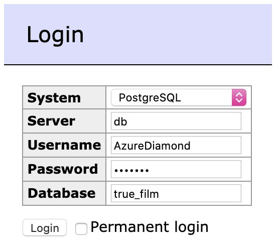

# TrueLayer challenge - TrueFilm™️ analytics 🎬

## Using this project

### Prerequisites

In order to run this pipeline, you'll need the following:

- [docker](https://docs.docker.com/get-docker/)
- [docker-compose](https://docs.docker.com/compose/install/)

They both have easy installers and on most platforms the installation for the desktop client for `docker` includes `docker-compose`.

### Running the pipeline

With the above installed, you can start the TrueFilm™️ pipeline by running the following command in the root directory of the project:

```bash
docker-compose up --build
```

I'm afraid it will be slow to build the first time, as it needs to download ~550MB worth of data but should be fine after that.

### Viewing results

`adminer` is running which will let you see the results.

You can access it from your browser at `localhost:8080`. You will need the following to login:

- System: `PostgreSQL`
- Server: `postgres`
- Username: `AzureDiamond`
- Password: [hunter2](https://knowyourmeme.com/memes/hunter2)
- Databse: `true_film`



## Choices

### Datasets

You will probably notice that the datasets for this pipeline come from different URLs to those specified. For the reasons below, I decided it was easier to download from versions I'd fetched and processed. Obviously in reality I would use some appropriate blob store (S3/GCS) rather than the super-professional, enterprise-grade, collaborative cloud document store Dropbox Personal (🤦‍♀️).

The movies metada from Kaggle was behind a registration wall (a prohibitively faffy step I wanted to avoid for the reviewer), so I made an easier public link for it.

The wikimedia dump was a large (~7.6GB extracted), XML file. This is pretty cumbersome for analytics so I took the fields we want (`title`, `abstract` and `url`) and wrote them out to a columnar format. The process for downloading and transforming the wikimedia data is in the `staging` folder should you want to reproduce it.

### Production Companies

There's clearly a many-to-many relationship between movies and production companies which I chose not to reflect in the schema. Ultimately, I looked at this as an exercise in warehousing. We don't want a pipeline to fail completely because of a key constraint from some messy data; our analysts don't want to be thinking about joins; and our dashboards prefer denormalised data.

## Reflections

### Abstracts

I'm not sure if there's some issue with the data I'm working from (the CSV I got from kaggle is much smaller than expected) or that I have extracted them incorrectly, but the abstracts for film articles on WikiPedia have come out rather strangely (looks like metadata from the info box). This seems to affect films in particular so _perhaps_ it's actually not entirely my fault 😬

### Cleaning of movie data

There's a comment with my full take on this on the appropriate test. In short, I chose an arbitrary rule for deciding if we should use a given movie in the analysis: it must have both a revenue _and_ a budget of at least 1,000.

This is obviously risk as the whole point is to explore the ratio between the two so a correct anomaly would be very exciting (huge revenue for only $100 😱) or [totally horrifying](https://en.wikipedia.org/wiki/Cats_(2019_film)#Box_office).

Obviously this and the matching logic discussed below are where substantial time would be spent improving the pipeline. A more nuanced heuristic that takes into account the year and country in which the movie was made would be a good start. An arbitrary threshold serves well, however, for this exercise.

### Rudimentary rulesets

The rules for matching a movie to a WikiPedia article here are fairly simple (an article named for a film from that year, failing that any film with the same name, failing that any article with the same name), but I think that they give a good starting point.

Clearly, there's opportunity to abstract away the complexity of preferring certain matches (perhaps similar to the `process_steps` in the two classes) so that the rules could be built on in a more maintainable way. I would expect a pipeline like this to introduce new business logic over time so it's important that new rules can be added more declaratively to prevent copy-pasta errors.

Sadly, I didn't have time to finish the tests for the matching logic (but have left some titles to give an idea). Before any refactoring to make the rules simpler to extend, there really should be a test for each rule that ensures its precedence.

### ART

While working on this, I learned of the film [_Avalanche Sharks_](https://www.youtube.com/watch?v=1rvSLOop59A), a made-for-tv 'horror' movie set during a bikini contest at a ski resort.

Based on the trailer alone, I can very confidently say that it is art.
